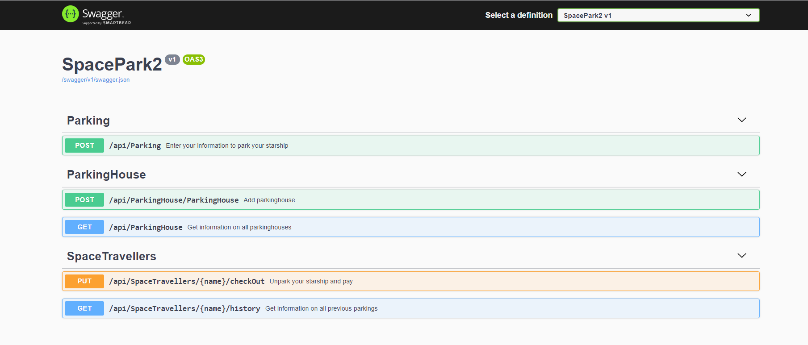
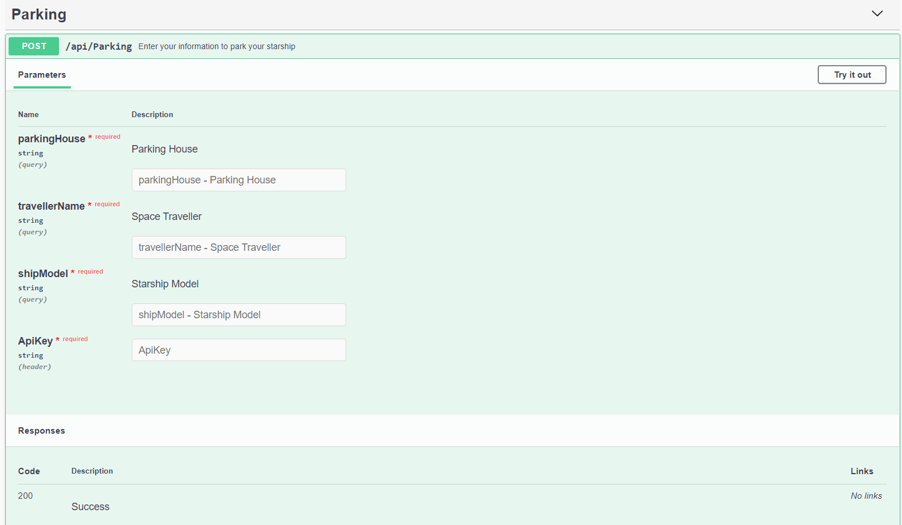
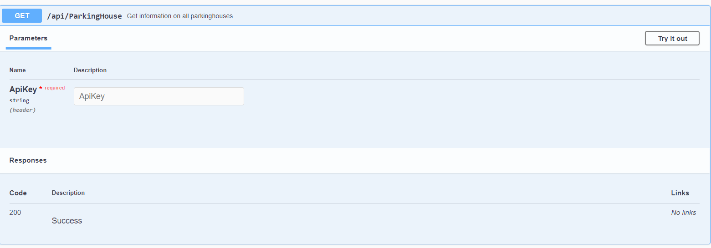
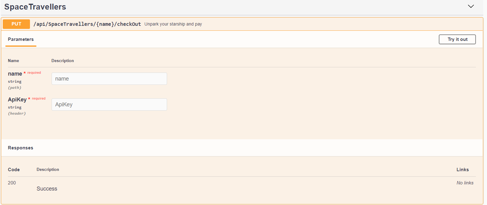
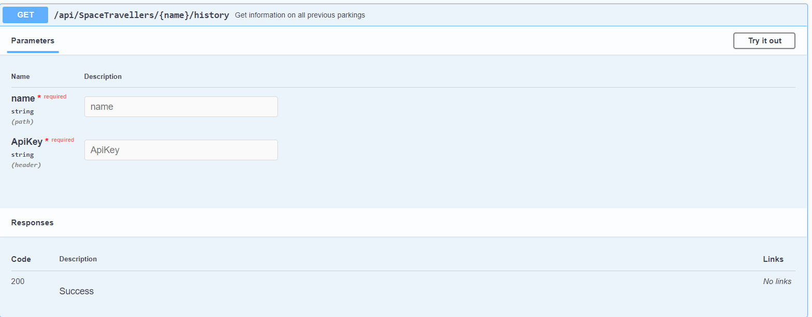

## Bild på API

## Endpoints

**POST Parking**

/api/Parking/parkingHouse/ travellerName /shipModel

**POST Parkinghouse**

/api/ParkingHouse/ParkingHouse/name/capacity

**GET Parkinghouse**

/api/ParkingHouse

**PUT Spacetraveller** 

/api/SpaceTravellers/{name}/checkOut

**GET Spacetraveller**

/api/SpaceTravellers/{name}/history

